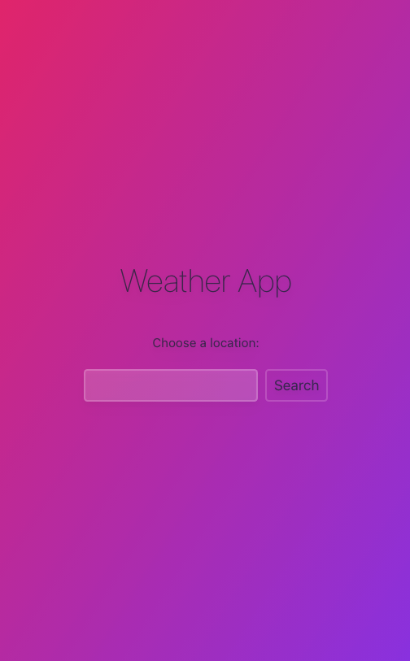
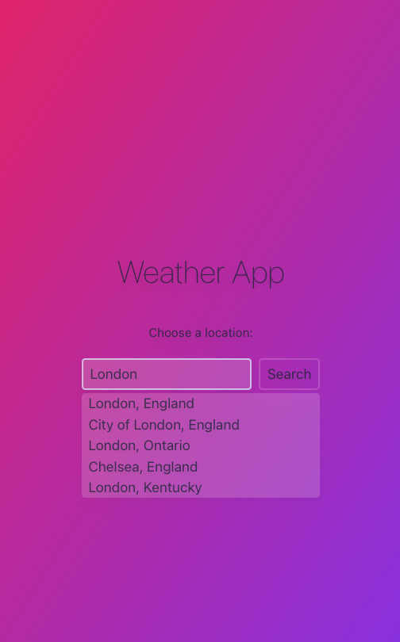
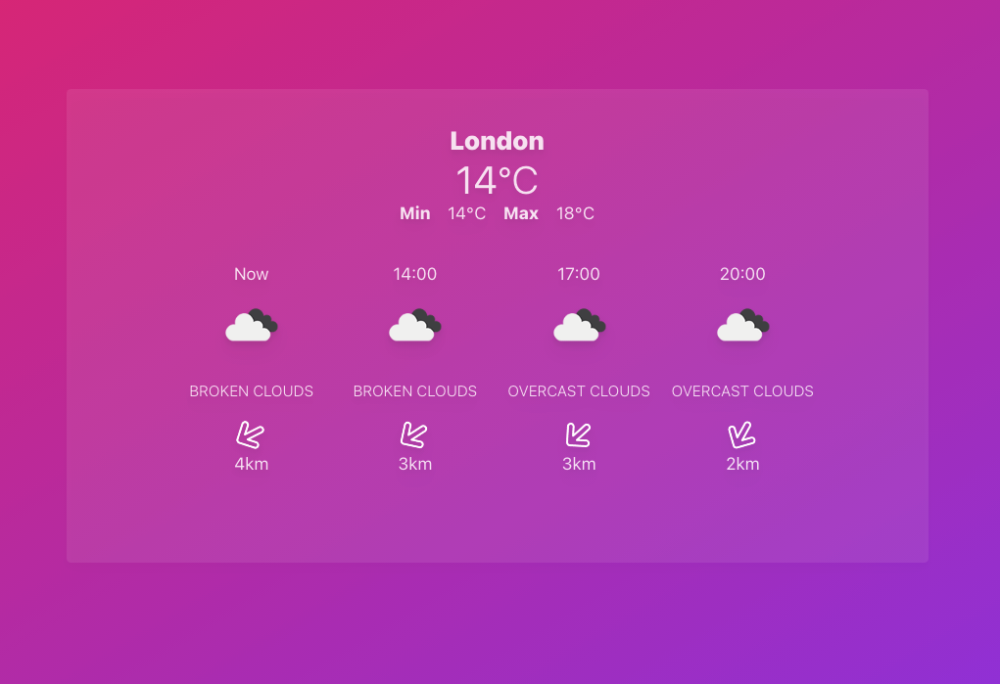
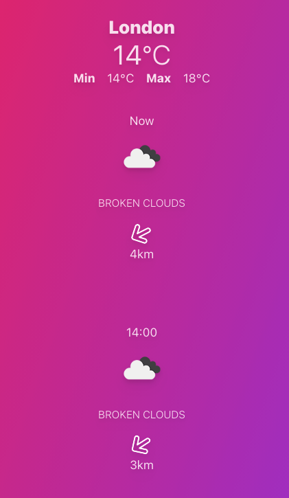

# Weather App
## Overview
A weather app using the openweather location and weather APIs.
## Screenshots
### Search



### Forecast
#### Large Device


#### Small Device


## Build
I built the app using TypeScript, React and Tailwind.

### Fetching Data

I created the Search function and useForecast custom hook using Openweather's Geo and Forecast APIs.

#### Geo API
I used the Geo API in order to send the typed data to the API and return 5 options. Once one option is 'searched' then the data object is returned (of which we use the longitude and latitude coordinates for the Forecast API call).

#### Forecast API
The Forecast API returns the forecast object.

``` JavaScript
	function getForecast(city: OptionsType) {
		fetch(
			`${BASE_URL}/data/2.5/forecast?lat=${city.lat}&lon=${city.lon}&units=metric&appid=${API_KEY}`
		)
			.then((res) => res.json())
			.then((data) => {
				const forecastData = structuredClone(data);
				setWeatherForecast(forecastData);
			});
	}
```
### Displaying Data

Once the forecast data is received then Forecast.tsx is rendered and Search.jsx is unmounted.
The following data is rendered in the header:
- Location
- Current Temperature (celsius)
- Minimum Temperature (12 hour timeframe)
- Maximum Temperature (12 hour timeframe)

The following data is mapped:
- Time ('Now' or HH:MM)
- Weather image
- Weather description
- Wind direction (as image)
- Wind speed (km)

#### Wind Direction

For accessiblity I have provided wind direction in exact degrees (in the img alt text).

The arrow image is also rendered, with its default direction set to north (0 degrees). The returned Forecast data rotates the image using inline CSS to give a visual representation of the wind direction.

``` JavaScript

```

### Styling

This was my first time using Tailwind and I liked that it has a built in CSS reset, so that I could create styling elements 'from scratch'. I found it easy to pick up and it improved my workflow as I didn't have to switch back and forth between pages. In this project I didn't set up any personalised global variants (e.g. 'primary' colour) but I would consider doing so if creating a larger pair or collaborative project.

